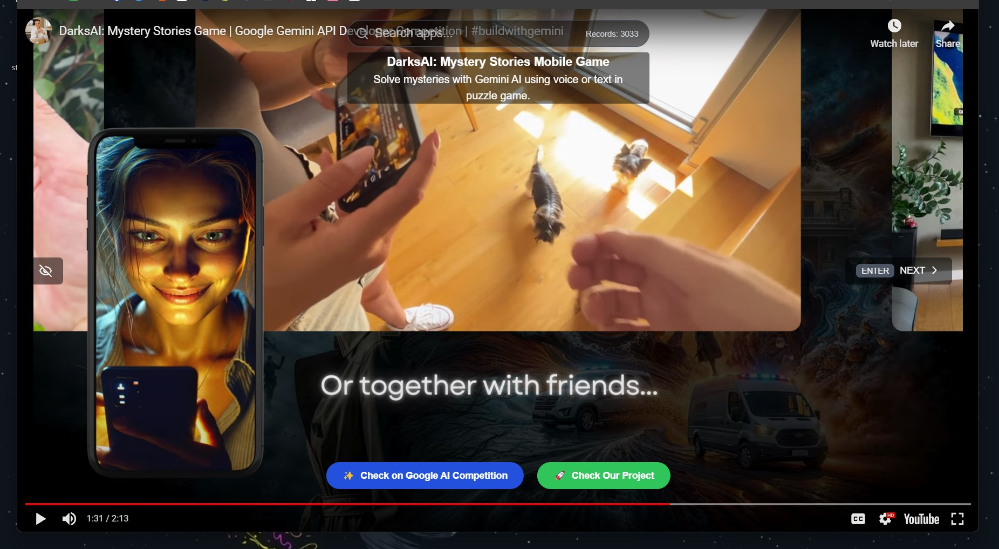

<div align="center">
  <p>
    🤝 Show your support - give a ⭐️ if you liked the content
  </p>
  <p>
    <a target="_blank" href='https://twitter.com/pulik_io'></a>
  </p>
</div>

---

# 📺 Unofficial Google AI Competition TV

This project showcases innovative AI projects from the Google AI Competition, allowing users to explore, filter, and quickly navigate through them. The competition can be found at: https://ai.google.dev/competition


My submission to the competition: https://ai.google.dev/competition/projects/darksai-mystery-stories-mobile-game


## 🌐 Live Demo

Experience the Unofficial Google AI Competition TV in action:

### [**🔗 Live Demo**](https://google-ai-competition-tv.vercel.app/)




## ✨ Features

- Watch demo videos of AI projects 🎥
- Search for specific apps 🔍
- Discover a wide range of AI applications 🚀
- User-friendly interface for easy navigation 🖱️

## 🚀 Getting Started

1. Clone the repository:
   ```bash
   git clone https://github.com/yourusername/google-ai-competition-tv.git
   ```

2. Install dependencies:
   ```bash
   npm install
   # or
   yarn install
   ```

3. Run the development server:
   ```bash
   npm run dev
   # or
   yarn dev
   ```

4. Open [http://localhost:3000](http://localhost:3000) with your browser to see the result.

## 🛠️ Built With

- [Next.js](https://nextjs.org/) - The React framework for production
- [React](https://reactjs.org/) - A JavaScript library for building user interfaces
- [TypeScript](https://www.typescriptlang.org/) - Typed JavaScript at Any Scale
- [Tailwind CSS](https://tailwindcss.com/) - A utility-first CSS framework

## 📝 Usage

- Use the search bar to find specific AI projects or technologies.
- Click on the "Next" button or press Enter to cycle through different project videos.
- Toggle the UI visibility using the eye icon on the left side of the screen.
- Click on "Check on Google AI Competition" to view more details about the current project.

## 🤝 Contributing

Contributions, issues, and feature requests are welcome! Feel free to check [issues page](https://github.com/yourusername/google-ai-competition-tv/issues).

## 📄 License

This project is open source and available under the [MIT License](LICENSE).

## 🙏 Acknowledgements

- Google AI Competition for creating Google AI Competition
- All the innovative AI developers who participated in the competition
